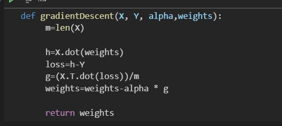

# Build Model
* **Used This Cost Function Equation** 

  

* **Gradient Decent**

* **Fit Function**

* **Predict Function**

* **Evaluate Performance**
> **``I Found that these metrics are the best to evaluate my model and tried to use the two metrics just to practice more``**

1. by Mean absolute error (MAE) 

2. by Coefficient of Determination or R^2

# Explore Data
* ## UniVariate DataSet

* **Plot Data X and Y**

* **Result of My model** 

> * r2  = > Coefficient of Determination 
> * mae = >  Mean absolute error
  

* **Result When used Sicit_learn Linear Regression Model**

* **I Tried to see at any iteration must stop because the cost function doesn't decrease more**
> 2000 iteration sounds good

* **I Tried to Visualize Error of Train and Test data to Compare between them and see the Performance of my model**

* **Plot best fit line on data**

* ## MuliVariate DataSet
>**``at the first, I didn't do scaling but it gives ``nan`` Values in the prediction of output and subsequently in Metrics to evaluate the performance``**
* **Feature Scaling** 
> **``Due to range of each Features are differ from each other we must do Standardization``**

* **Result of My model** 

> * r2  = > Coefficient of Determination 
> * mae = >  Mean absolute error

* **Result When used Sicit_learn Linear Regression Model**

* **I Tried to see at any iteration must stop because the cost function doesn't decrease more**
> 5000 iteration sounds good

* **I Tried to Visualize Error of Train and Test data to Compare between them and see the Performance of my model**

